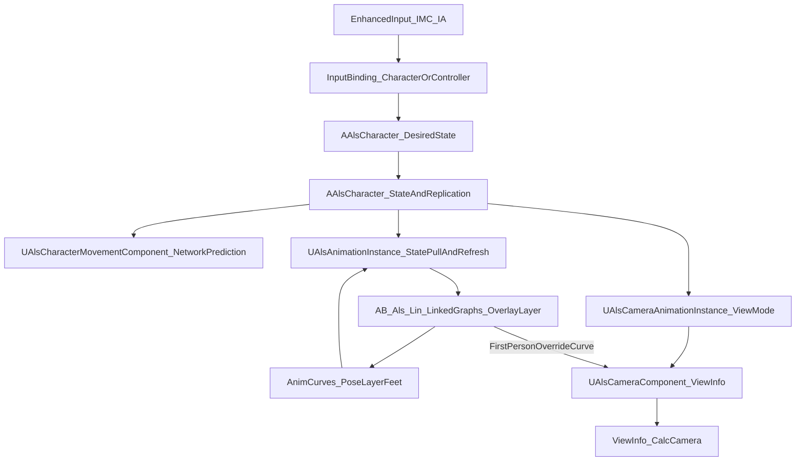

## 玩家 3C 系统（ManteumTower 当前实现：Control + Character + Camera + Animation）

本文基于蓝图快照 `D:\ManteumTower\BlueprintSnapshot` 与项目代码（`D:\Workspace\MT\Engine\ManteumTower\Plugins\ALS-Refactored`）整理**当前玩家 3C（Control + Character + Camera）与动画（Animation）之间的真实链路**，目标是：

- 让后续迭代能稳定扩展（新动作/新 Overlay/新运动模式）
- 能快速定位常见“动画像坏了”的根因（状态口径、曲线、TIP、转场、IK）

### 0) 3C 在本项目中的定义

- **Control**：输入系统（Enhanced Input 的 `IMC/IA`）与输入绑定位置（Controller / Character）以及“输入 → Desired 状态”的映射。
- **Character**：角色移动/旋转/姿态与可复制的权威状态（`ViewMode/RotationMode/Stance/Gait/OverlayMode/LocomotionMode` 等 Tag 与连续运动学量）。
- **Camera**：相机组件（`UAlsCameraComponent`）+ 相机 AnimBP（`AB_Als_Camera`）+ 曲线驱动（如 `FirstPersonOverride`）的取景、遮挡 Trace、左右肩、FOV 与相机震动等。
- **Animation**：角色 AnimBP（`AB_Als_Lin` + Linked 子图 + Overlay Layer）对 Character 状态的读取与混合表现；并通过曲线回读把“Layer/Pose/Feet”等系统量写回 C++ State。动画系统的详细说明（资产结构、曲线约定、转场/TIP、蒙太奇与 AnimNotify、相机联动）见 [09-player-animation-system](09-player-animation-system.md)。

### 0.1 3C 总览图（当前实现）

### 1) 资源与分层（你们现在到底在用什么）

#### 1.1 主 AnimBP 与子图（Linked Anim Graph）

当前项目存在两套：ALS 默认资源与 Lin 角色专用资源。实际用于玩家角色表现的是 **Lin 专用主 ABP**：

- **主 AnimBP**：`/Game/Art/Character/Lin/ABP/AB_Als_Lin`（`AB_Als_Lin_C`）
- **Overlay Layer**：`/ALS/ALS/Character/ALI_Overlay`（Linked Anim Layer，节点标题常见为 `ALI_Overlay - Overlay`）
- **Linked 子图（`UAlsLinkedAnimationInstance` 派生）**：
  - `/Game/Art/Character/Lin/ABP/AB_Als_Lin_Locomotion`
  - `/Game/Art/Character/Lin/ABP/AB_Als_Lin_Grounded`
  - `/Game/Art/Character/Lin/ABP/AB_Als_Lin_Layering`
  - `/Game/Art/Character/Lin/ABP/AB_Als_Lin_Head`
  - `/Game/Art/Character/Lin/ABP/AB_Als_Lin_Ragdolling`
  - `/Game/Art/Character/Lin/ABP/AB_Als_Lin_Standing`
  - `/Game/Art/Character/Lin/ABP/AB_Als_Lin_Crouching`
  - `/Game/Art/Character/Lin/ABP/AB_Als_Lin_Default`

> 说明：ALS 默认主 ABP 为 `/ALS/ALS/Character/AB_Als`，结构类似，但 Lin 这一套把关键子图替换成了 `/Game/Art/Character/Lin/ABP/*`。

#### 1.2 “单一真相来源”在代码里是谁

**离散状态（Tag）由 `AAlsCharacter` 维护，AnimInstance 每帧拉取**，而不是让 ABP 在图里到处拼 Bool：

- 动画实例类：`UAlsAnimationInstance`（`AlsAnimationInstance.h/.cpp`）
- 关键状态字段（均为 `FGameplayTag`）：
  - `ViewMode / LocomotionMode / RotationMode / Stance / Gait / OverlayMode`
- 关键刷新点：`UAlsAnimationInstance::NativeUpdateAnimation()` 在 GameThread 中执行：
  - `ViewMode = Character->GetViewMode();`
  - `LocomotionMode = Character->GetLocomotionMode();`
  - `RotationMode = Character->GetRotationMode();` 等

### 1.3 Camera / Control / Character 的关键资产定位（便于对照项目）

- **Camera（代码）**：`ALSCamera` 模块
  - `UAlsCameraComponent`：`.../ALSCamera/Public/AlsCameraComponent.h` + `Private/AlsCameraComponent.cpp`
  - 相机 AnimInstance：`.../ALSCamera/Public/AlsCameraAnimationInstance.h`
  - 相机曲线常量：`.../ALSCamera/Public/Utility/AlsCameraConstants.h`（`FirstPersonOverride`）
  - 相机设置：`.../ALSCamera/Public/AlsCameraSettings.h`
  - 相机震动通知：`.../ALSCamera/Public/Notifies/AlsAnimNotify_CameraShake.h`
- **Control（参考实现代码）**：`ALSExtras`
  - `AAlsCharacterExample`：`.../ALSExtras/Public/AlsCharacterExample.h` + `Private/AlsCharacterExample.cpp`
- **Character（代码）**：`ALS`
  - `AAlsCharacter`：`.../ALS/Public/AlsCharacter.h` + `Private/AlsCharacter.cpp`
  - `UAlsCharacterMovementComponent`：`.../ALS/Public/AlsCharacterMovementComponent.h` + `Private/AlsCharacterMovementComponent.cpp`
- **快照中的相关蓝图资产**（用于对照而非权威逻辑）：
  - 玩家控制器（UI/Overlay 菜单）：`/ALS/ALSExtras/Core/B_Als_PlayerController`
  - 相机组件蓝图：`/ALS/ALSCamera/B_Als_CameraComponent`
  - 相机 AnimBP：`/ALS/ALSCamera/AB_Als_Camera`

### 2) Camera（相机）：视角、取景、左右肩、遮挡与震动

#### 2.1 ViewMode：第一/第三人称的权威开关

- **权威来源**：`AAlsCharacter::ViewMode`（Replicated），取值为：
  - `AlsViewModeTags::ThirdPerson`
  - `AlsViewModeTags::FirstPerson`
- **读者**：
  - 角色动画实例：`UAlsAnimationInstance::NativeUpdateAnimation()` 每帧同步 `ViewMode`
  - 相机动画实例：`UAlsCameraAnimationInstance` 同步 `ViewMode`（相机侧会据此选择/约束逻辑）

#### 2.2 相机组件：`UAlsCameraComponent`（挂在角色 Mesh 上）

`UAlsCameraComponent` 继承自 `USkeletalMeshComponent`，用于输出 `ViewInfo`（位置/旋转/FOV/后处理权重等）。参考实现中（`AAlsCharacterExample`）相机组件创建并挂载在 Mesh：

- `Camera = CreateDefaultSubobject<UAlsCameraComponent>(...)`
- `Camera->SetupAttachment(GetMesh())`

快照中对应蓝图资产：`/ALS/ALSCamera/B_Als_CameraComponent`（父类 `AlsCameraComponent`）。

#### 2.3 取景入口：`AAlsCharacter::CalcCamera()` → `Camera->GetViewInfo()`

- `AAlsCharacter` 重载 `CalcCamera(float DeltaTime, FMinimalViewInfo& ViewInfo)`；并提供 `OnCalculateCamera`（BlueprintNativeEvent）作为可扩展点。
- 在参考实现 `AAlsCharacterExample::CalcCamera()` 中：若相机组件处于 Active，则直接 `Camera->GetViewInfo(ViewInfo)`，否则走 `Super::CalcCamera`。

#### 2.4 第一/第三人称的关键算法点（Socket + Trace + 右肩）

相机组件内部会基于 Settings 与 Mesh Socket 计算：

- **第一人称位置**：`GetFirstPersonCameraLocation()` 取 Mesh 上 `Settings->FirstPerson.CameraSocketName`（默认名 `FirstPersonCamera`）。
- **第三人称 Pivot**：`GetThirdPersonPivotLocation()` 由两个 Pivot Socket 插值得到；并维护 PivotTarget/PivotLag 等用于平滑。
- **遮挡处理**：第三人称使用 Sweep/Trace（可配置 TraceChannel、TraceRadius、Offset、以及距离平滑）解决穿模遮挡。
- **左右肩**：通过 `bRightShoulder` 与 `TraceShoulderLeftSocketName/TraceShoulderRightSocketName` 切换第三人称 Trace 起点（肩位）。

#### 2.5 `FirstPersonOverride` 曲线：Animation → Camera 的软切换通道

- 相机侧定义曲线名常量：`FirstPersonOverride`（见 `AlsCameraConstants.h`）。
- `UAlsCameraComponent` 在 Tick/更新中会读取相机 AnimInstance 的曲线：
  - 当 `FirstPersonOverride == 1`：强制第一人称位置与第一人称 FOV
  - 当 `0 < FirstPersonOverride < 1`：在第一/第三人称位置与 FOV 之间插值
  - 当 `FirstPersonOverride == 0`：走第三人称逻辑

这使得“镜头是否进入第一人称/过肩镜头”可以由动画曲线驱动，而不必在 Gameplay 里硬切相机。该曲线通常由角色或相机 AnimBP 在相应分支中写入，具体写入位置与约定见 [09-player-animation-system](09-player-animation-system.md)。

#### 2.6 相机震动（Camera Shake）

- 快照中存在 `B_Als_CameraShake_Sprint`（用于 Sprint 的镜头震动）。
- 插件提供 `AlsAnimNotify_CameraShake`，可在动画序列/蒙太奇里触发相机震动（让震动与步态/动作严格对齐）。

### 3) Control（输入控制）：Enhanced Input → Desired 状态 → Character

#### 3.1 输入绑定位置（参考实现：绑定在 Character）

参考实现 `AAlsCharacterExample::SetupPlayerInputComponent` 使用 Enhanced Input，绑定发生在 Character 上而非 PlayerController：

- `UEnhancedInputComponent::BindAction(...)` 绑定 Look/Move/Sprint/Walk/Crouch/Jump/Aim/Ragdoll/Roll/RotationMode/ViewMode/SwitchShoulder 等。

快照中也能看到 EnhancedInput 相关资产引用（`EnhancedInputLocalPlayerSubsystem`、`InputAction`、`InputMappingContext` 等）。

#### 3.2 Mapping Context 的添加与移除（Possess 切换时保证正确）

参考实现 `AAlsCharacterExample::NotifyControllerChanged()`：

- 从旧 Player 的 `UEnhancedInputLocalPlayerSubsystem` 移除 `InputMappingContext`
- 给新 Player 添加 `InputMappingContext`

这避免了“切换/重生/重新 Possess 后输入失效或绑到旧 Pawn”的常见问题。

#### 3.3 常用 IA/IMC（ALS 数据资产）

在 ALS 数据中常见（快照可见）的 InputAction/InputMappingContext 包括：

- **移动/视角**：`IA_Als_Move`、`IA_Als_Look`、`IA_Als_LookMouse`
- **姿态/步态**：`IA_Als_Sprint`、Walk、Crouch、Jump
- **战斗/动作**：`IA_Als_Aim`、Roll、Ragdoll
- **模式**：RotationMode、ViewMode、SwitchShoulder
- **UI**：`IMC_Als_UI`（例如 OverlayMode 菜单、ToggleUI、Slomo 等；快照的 `B_Als_PlayerController` 主要在做 UI 侧输入）

> 注：项目也可能在 Controller 蓝图里绑定部分输入（尤其 UI/调试）；以“玩家实际 Pawn/Controller 绑定”为准，文档这里以 ALS-Refactored 的参考实现与快照证据为主。

#### 3.4 输入到状态的映射（示例：参考实现的落点）

参考实现中典型映射为：

- Look → `AddControllerPitchInput / AddControllerYawInput`
- Move → 读取 Controller `PlayerViewPoint`（优先用相机的精确旋转）→ `AddMovementInput`
- Sprint → `SetDesiredGait(Sprinting/Running)`
- Walk Toggle → `SetDesiredGait(Walking/Running)`
- Crouch Toggle → `SetDesiredStance(Standing/Crouching)`
- Aim → `SetDesiredAiming(bool)`
- ViewMode Toggle → `SetViewMode(FirstPerson/ThirdPerson)`
- RotationMode Toggle → `SetDesiredRotationMode(...)`
- SwitchShoulder → `Camera->SetRightShoulder(...)`

### 4) Character（角色移动与旋转）：权威状态、复制、应用时机与网络预测

#### 4.1 权威与复制：哪些状态是“系统的真相来源”

`AAlsCharacter` 会维护并复制（或参与预测）的关键状态（节选，详见 `AlsCharacter.h`）：

- **Desired（输入意图）**：`bDesiredAiming`、`DesiredRotationMode`、`DesiredStance`、`DesiredGait`
- **View/Overlay**：`ViewMode`（Replicated）、`OverlayMode`（ReplicatedUsing）
- **运行时 State**：`LocomotionMode`、`RotationMode`、`Stance`、`Gait`、`LocomotionAction`
- **与输入相关的网络量**：`InputDirection`（Replicated）、`DesiredVelocityYawAngle`（Replicated）

动画实例与相机实例多数情况下都是**读**这些状态，然后做表现与平滑。

#### 4.2 应用时机：从 Desired 落到实际 RotationMode/Stance 等

`AAlsCharacter` 内部存在一系列“把 Desired 应用到实际”的入口，例如：

- `ApplyDesiredStance()`：把 `DesiredStance` 落到实际姿态与 Movement/胶囊等
- `RefreshRotationMode()`：根据 DesiredAiming/DesiredRotationMode 等刷新实际 `RotationMode`
- `OnMovementModeChanged()` / `NotifyLocomotionModeChanged()`：切换 Grounded/InAir 时联动姿态、滚翻/布娃娃等动作

这保证了：**输入只需要写 Desired**，其余系统（Movement/Animation/Camera）读取一致的权威状态即可。

#### 4.3 移动组件：`UAlsCharacterMovementComponent` 的旋转策略与网络预测字段

`UAlsCharacterMovementComponent` 关闭 UE 默认的“面向移动方向”旋转（`bOrientRotationToMovement=false`），旋转由 ALS 的 RotationMode 逻辑统一管理。

另外它的网络预测数据会携带额外字段来保证预测一致性（见 `AlsCharacterMovementComponent.h`）：

- `RotationMode`
- `Stance`
- `MaxAllowedGait`

客户端的 `FSavedMove` 与网络 MoveData 中都包含这些 Tag，从而避免“客户端预测与服务器判定不一致导致抖动/回滚”。

### 5) Animation（角色动画）：运行时数据流（GameThread → 曲线回读 → PostUpdate）

> 动画资产结构、曲线体系、转场/TIP、蒙太奇与 AnimNotify 的详细说明见 [09-player-animation-system](09-player-animation-system.md)。

#### 5.1 GameThread：状态同步 + 运动学量刷新（驱动所有“连续量”）

`UAlsAnimationInstance::NativeUpdateAnimation(DeltaTime)` 的核心顺序（省略无关分支）：

- **同步离散 Tag**：View/Locomotion/Rotation/Stance/Gait/Overlay
- **刷新连续状态（GameThread）**：
  - `RefreshMovementBaseOnGameThread()`
  - `RefreshViewOnGameThread()`
  - `RefreshLocomotionOnGameThread()`
  - `RefreshInAirOnGameThread()`
  - `RefreshFeetOnGameThread()`
  - `RefreshRagdollingOnGameThread()`

> 这意味着：如果你在蓝图/AS 里“每帧改动连续量”，很容易和 ALS 自己的刷新打架，出现抖动或网络不一致。

#### 5.2 并行评估：曲线回读（AnimGraph → C++ State）

`UAlsAnimationInstance::NativeThreadSafeUpdateAnimation(DeltaTime)` 会在并行更新中做：

- `RefreshLayering()`：从曲线回读 Layer 权重（Head/Arms/Spine/Pelvis/Legs 等）写入 `FAlsLayeringState`
- `RefreshPose()`：从曲线回读 Pose 权重写入 `FAlsPoseState`，包含：
  - `PoseGrounded / PoseInAir`
  - `PoseStanding / PoseCrouching`
  - `PoseMoving / PoseGait`
- `RefreshView(DeltaTime)`、`RefreshFeet(DeltaTime)`、`RefreshTransitions()` 等

#### 5.3 PostUpdate：播队列（转场 / TIP）

`UAlsAnimationInstance::NativePostUpdateAnimation()` 里会：

- `PlayQueuedTransitionAnimation()`
- `PlayQueuedTurnInPlaceAnimation()`
- `StopQueuedTransitionAndTurnInPlaceAnimations()`

这也是为什么“某些转场/TIP 触发点”看上去像是延后一帧生效：它们是**队列式**的。

### 6) Animation 大状态入口与已实现范围

#### 6.1 `LocomotionMode` 的映射现状（非常关键）

在 `AAlsCharacter::OnMovementModeChanged()` 里，默认只覆盖：

- `MOVE_Walking/MOVE_NavWalking` → `AlsLocomotionModeTags::Grounded`
- `MOVE_Falling` → `AlsLocomotionModeTags::InAir`
- 其他 MovementMode → `FGameplayTag::EmptyTag`

也就是说：**你们当前实现里“Grounded/InAir”是完整闭环，其它运动模式默认会落到 EmptyTag**。若出现“进入游泳/攀爬/自定义移动后动画失控”，第一检查点就是：有没有把 MovementMode/CustomMode 映射到一个明确的 `LocomotionMode`。

### 7) Lin 子图里已观察到的关键机制（快照事实）

#### 7.1 `AB_Als_Lin_Locomotion`：转场通知与对 Parent 的调用

从快照可见：

- `AB_Als_Lin_Locomotion` 的父类是 `AlsLinkedAnimationInstance`
- 存在 `AnimNotify_LandToGrounded`
- 蓝图内会通过 `GetParent` → 调用 Parent（`AlsAnimationInstance`）上的函数，例如 `PlayTransitionRightAnimation()`
- 存在辅助函数：`StopTransitionAndTurnInPlaceAnimations()`（用于打断转场/TIP）

#### 7.2 `AB_Als_Lin_Grounded`：Grounded 状态机与 Roll→Grounded 转场

从快照可见：

- 状态机节点标题为 `Grounded States`
- 存在函数：`PlayRollToGroundedTransitionAnimation()` 与 `StopTransitionAndTurnInPlaceAnimations()`
- 存在 “Input caching.” 注释块：说明 Grounded 子图内部对输入/意图存在缓存式处理（用来提升转向/急停/起步等过渡的稳定性）

### 8) 经验要点（结合你们当前实现，落在检查点上）

#### 8.1 ABP 不要“二次推导大状态”

- **推荐口径**：UE `MovementMode/CustomMode` →（角色侧）`LocomotionMode(Tag)` →（AnimInstance 拉取）→（ABP 按 Tag 分支）
- 在你们项目里，`LocomotionMode` 的权威来源就是 `AAlsCharacter`，AnimBP 只做“选择与混合”。

#### 8.2 3C（旋转/移动）与动画表现解耦

- 角色朝向更新属于 3C（Character/Movement 侧）；ABP 用 AimOffset/Strafe/TIP 表现即可。
- ALS Locomotion 图里存在一个实践点：**忽略 `RotationYawSpeed` 曲线的惯性化影响**，避免 TIP Montage 淡出时“卡住角色继续按输入旋转”。

#### 8.3 曲线是“系统级接口”，不是装饰

你们代码里 `RefreshPose()/RefreshLayering()` 会回读曲线并写入 State。结果是：

- 曲线不对（缺失/命名不一致/某分支没写）→ C++ State 就不对 → 后续混合、IK、转场、TIP 都会连锁异常。

### 9) 扩展模板：新增一个运动模式（以 Swimming 为例，按你们当前代码改最少）

#### 9.1 MVP：先让 `LocomotionMode` 不再是 EmptyTag

- **角色侧（C++）**
  - 在 `AAlsCharacter::OnMovementModeChanged()` 增加 `MOVE_Swimming`（或你的 CustomMovementMode）→ 设置 `LocomotionMode` 为一个明确 Tag（建议新增 `AlsLocomotionModeTags::Swimming`）
- **动画侧（Lin 子图）**
  - 在 `AB_Als_Lin_Locomotion` 按 `LocomotionMode` 增加分支，接入游泳 Idle/Move（先不强求 Pose 曲线对称）

#### 9.2 进阶：补齐 Pose 曲线对称性（降低长期维护成本）

- **AnimGraph**：写入 `PoseSwimming` 曲线（并明确互斥/权重约定）
- **C++**：`UAlsConstants` + `FAlsPoseState` + `RefreshPose()` 补齐 `SwimmingAmount`

### 10) 调试与验收清单（按“最快定位根因”排序）

- **状态口径**：`LocomotionMode/RotationMode/Stance/Gait/OverlayMode` 是否符合预期（特别是有没有变成 EmptyTag）
- **Control → Desired**：输入触发后（本地/联机）`DesiredGait/DesiredStance/DesiredRotationMode/bDesiredAiming/ViewMode` 是否按预期变化
- **Camera**：`ViewMode` 与相机第一/第三人称是否一致；`FirstPersonOverride` 曲线是否在需要时输出（0/1/插值）
- **曲线回读**：`PoseGrounded/PoseInAir/PoseStanding/PoseCrouching/PoseMoving/PoseGait` 是否在正确分支有权重
- **转场/TIP**：`StopTransitionAndTurnInPlaceAnimations()` 是否在关键打断点被触发（避免转场残留）
- **IK/脚锁**：Feet 相关曲线（IK/Lock/Planted/Crossing）是否正常输出，否则脚部会出现明显滑移/跳变

若问题落在**动画曲线、状态机分支、蒙太奇或 AnimNotify** 上，请结合 [09-player-animation-system](09-player-animation-system.md) 的调试与验收章节排查。

