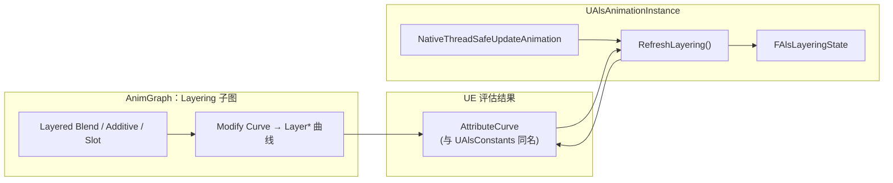

# ALS-Refactored：C++ AnimInstance 与 AnimBP 框架、Layering 曲线数据流

本文沉淀 **ALS-Refactored** 中「主 AnimBP + `UAlsAnimationInstance`」的职责划分、三阶段刷新，以及 **Layering 分层** 所用曲线从动画图到 `FAlsLayeringState` 的数据流（与项目内 `Plugins/ALS-Refactored/Source/ALS` 一致）。

资产路径、Linked 子图清单、蒙太奇与 Notify 详见 [09-player-animation-system](09-player-animation-system.md)；3C 与 Character 状态边界见 [08-player-3c-animation-system](08-player-3c-animation-system.md)。

---

## 1. 类与职责

| 层级 | 职责 |
|------|------|
| **`AAlsCharacter`** | 离散状态权威：`ViewMode`、`LocomotionMode`、`RotationMode`、`Stance`、`Gait`、`OverlayMode` 等 **GameplayTag**（含复制策略）。 |
| **`UAlsAnimationInstance`**（AnimBP 父类） | 每帧 **从 Character 拉取** 状态；在 **并行阶段** 从 AnimGraph 输出的 **Attribute 曲线** 读回 **Pose / Layering / Feet** 等到结构体；在 **PostUpdate** 中执行转场/TIP **蒙太奇队列**。 |
| **AnimBP / Linked 子图** | 按同步到实例上的变量做分支、状态机、BlendSpace、**Modify Curve**；**不做** Tag 的二次推导。Layering 子图（如 `AB_Als_Lin_Layering`）负责 **Head/Arms/Spine/Pelvis/Legs** 等分层混合的**视觉结果**。 |
| **`UAlsLinkedAnimationInstance`** | 子图实例通过 **`GetParent()`** 调主实例的 `RefreshGrounded` / `PlayTransition*` / `StopTransitionAndTurnInPlaceAnimations` 等。 |

**原则**：复杂规则（输入、武器、打断）在 Character/能力侧；ABP 负责表现与混合及曲线写入。

---

## 2. 三阶段刷新（代码入口）

以下为插件中的典型调用顺序，便于对照源码（`AlsAnimationInstance.cpp`）。

1. **`NativeUpdateAnimation`（GameThread）**  
   同步 Tag 与运动学相关刷新：`RefreshMovementBaseOnGameThread`、`RefreshViewOnGameThread`、`RefreshLocomotionOnGameThread`、`RefreshInAirOnGameThread`、`RefreshFeetOnGameThread`、`RefreshRagdollingOnGameThread` 等。

2. **`NativeThreadSafeUpdateAnimation`（并行 / 线程安全）**  
   在 AnimGraph 已对本帧 Pose 求值后，从 **`EAnimCurveType::AttributeCurve`** 读曲线并写入状态：  
   **`RefreshLayering()` → `RefreshPose()` → `RefreshView` → `RefreshFeet` → `RefreshTransitions()`**（顺序以当前实现为准）。

3. **`NativePostUpdateAnimation`**  
   `PlayQueuedTransitionAnimation`、`PlayQueuedTurnInPlaceAnimation`、`StopQueuedTransitionAndTurnInPlaceAnimations`：转场/TIP 的播放与停止多为**队列 + 延后一帧**语义。

---

## 3. Layering：曲线从哪里来、到哪里去

### 3.1 误区澄清

- **分层混合本身**在 **AnimGraph**（Layered blend、Additive、Slot 等）中完成。  
- **C++ 不驱动**各 Layer 的混合权重；`RefreshLayering()` 只是把当前帧图上 **写入的曲线值** 同步到 **`FAlsLayeringState`**，供蓝图、调试或其它逻辑读取。  
- 曲线名与 `UAlsLayeringState` 字段一一对应，定义见 `AlsConstants.h`（`LayerHead`、`LayerArmLeft`、`LayerSpine`…）与 `AlsLayeringState.h`。

### 3.2 数据流（简图）

### 3.3 实现要点（查阅源码时）

- **读曲线**：`RefreshLayering()` 使用 `AlsGetAnimationCurvesAccessor::Access(GetProxyOnAnyThread<FAnimInstanceProxy>(), EAnimCurveType::AttributeCurve)`，再按 `UAlsConstants::Layer*CurveName()` 查表。  
- **手臂 Mesh / Local**：`ArmLeftMeshSpaceBlendAmount` / `ArmRightMeshSpaceBlendAmount` 由 **`LayerArm*LocalSpace`** 曲线派生（Local 为满权重时与 Mesh 互斥），见 `RefreshLayering()` 内注释与 `FAnimWeight::IsFullWeight` 判断。  
- **资产工具**：`UAlsAnimationModifier_CreateLayeringCurves`（ALSEditor）可在 **AnimSequence** 上批量创建同名 Layer 曲线，便于对齐参考 Pose；运行时仍以 AnimGraph 写入为准。

---

## 4. 与相邻主题的边界

| 主题 | 文档 |
|------|------|
| 玩家 Lin 的 ABP 资产与曲线调试清单 | [09-player-animation-system](09-player-animation-system.md) |
| 3C、相机、`FirstPersonOverride` 等 | [08-player-3c-animation-system](08-player-3c-animation-system.md) |
| 移动加速度、阻尼、制动数据 | [10-als-data-config](10-als-data-config.md) |

---

## 维护说明

- 插件路径、函数名以 **`ManteumTower/Plugins/ALS-Refactored`** 为准；若上游 ALS 更新，以源码为准同步本文「三阶段」与 `RefreshLayering` 行为描述。
