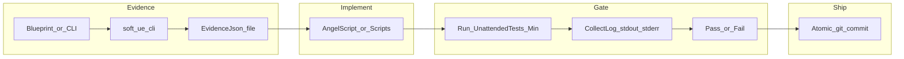

# 复盘与自动化工作流进化（Retro）

本文件沉淀「**复盘踩坑 → 迭代自动化工作流 → 写回 Kit**」的**可重复套路**，与技能 **retro-automation-workflow** 配套；易错点摘要仍在 [05-gotchas.md](05-gotchas.md)。

## 何时做

- 一段 **UE 自动化 / soft-ue-cli / 蓝图取证 / AS TDD / runner** 相关任务结束
- 用户说：**总结经验、复盘、迭代工作流、工作流进化、沉淀成 skill**
- `content/dev/pitfalls-inbox.md` 里已有条目待晋升

## 输出物（最小集）

1. **经验小结**（5–10 条可执行要点）
2. **踩坑清单**（按类别：终端/编码、桥与 CLI、AS 编译与门禁、Git、生成物）
3. **工作流变更清单**：更新了哪些 `rules` / `skills` / `content/knowledge` / `content/dev`
4. **验证**：指明项目侧门禁（如 `Scripts\Run-UnattendedTests-Min.ps1 -Mode AS`）或 Kit 侧脚本测试（若有）

## 数据流（总览）

见下文 Mermaid；与 [13-ue-automation-test-playbook.md](13-ue-automation-test-playbook.md)、[07-blueprint-query-workflow.md](07-blueprint-query-workflow.md)、[14-git-atomic-commits-tdd.md](14-git-atomic-commits-tdd.md) 交叉引用。

## 检查清单（Agent）

- [ ] 对照**仓库事实**：相关路径 `git log -n 20 --oneline`，避免文档与提交脱节（技能 **git-local-p4-workflow**）
- [ ] **坑**写入 `05-gotchas.md` 表格或 **本文件**「本轮附录」
- [ ] **操作步骤**写入 `content/dev/`（如 `git-automation.md`）
- [ ] **规则/技能**更新后自检：触发语不重复、与 METHODOLOGY 边界一致
- [ ] 更新 `content/knowledge/README.md`（若新增/重命名本类文档）

## 交叉引用

- 技能：`retro-automation-workflow`（执行套路）、`summarize-to-knowledge`（写回 content/）
- Dev：`content/dev/git-automation.md`、`content/dev/pitfall-capture.md`、`content/dev/pitfalls-inbox.md`
