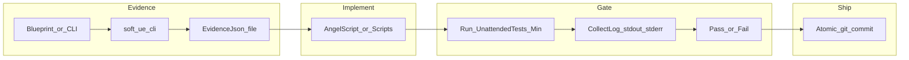
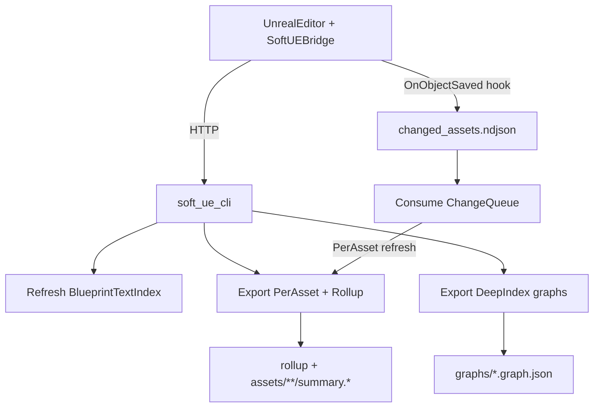

# 复盘与自动化工作流进化（Retro）

本文件沉淀「**复盘踩坑 → 迭代自动化工作流 → 写回 Kit**」的**可重复套路**，与技能 **retro-automation-workflow** 配套；易错点摘要仍在 [05-gotchas.md](05-gotchas.md)。

## 何时做

- 一段 **UE 自动化 / soft-ue-cli / 蓝图取证 / AS TDD / runner** 相关任务结束
- 用户说：**总结经验、复盘、迭代工作流、工作流进化、沉淀成 skill**
- `content/dev/pitfalls-inbox.md` 里已有条目待晋升

## 输出物（最小集）

1. **经验小结**（5–10 条可执行要点）
2. **踩坑清单**（按类别：终端/编码、桥与 CLI、AS 编译与门禁、Git、生成物）
3. **工作流变更清单**：更新了哪些 `rules` / `skills` / `content/knowledge` / `content/dev`
4. **验证**：指明项目侧门禁（如 `Scripts\Run-UnattendedTests-Min.ps1 -Mode AS`）或 Kit 侧脚本测试（若有）

## 数据流（总览）

见下文 Mermaid；与 [13-ue-automation-test-playbook.md](13-ue-automation-test-playbook.md)、[07-blueprint-query-workflow.md](07-blueprint-query-workflow.md)、[14-git-atomic-commits-tdd.md](14-git-atomic-commits-tdd.md) 交叉引用。

## 检查清单（Agent）

- [ ] 对照**仓库事实**：相关路径 `git log -n 20 --oneline`，避免文档与提交脱节（技能 **git-local-p4-workflow**）
- [ ] **坑**写入 `05-gotchas.md` 表格或 **本文件**「本轮附录」
- [ ] **操作步骤**写入 `content/dev/`（如 `git-automation.md`）
- [ ] **规则/技能**更新后自检：触发语不重复、与 METHODOLOGY 边界一致
- [ ] 更新 `content/knowledge/README.md`（若新增/重命名本类文档）
- [ ] **写资产必保存（硬门禁）**：凡通过 soft-ue-cli / UE Python 对 `.uasset` 做了写操作（reparent、删变量、改图/连线、改 defaults 等），必须在同一段操作里 Save，并在关键里程碑重复 Save（至少 reparent 后、compile 通过后各保存一次）。默认 UE 随时可能闪退，未保存改动视为不存在。
- [ ] **桥不可达时也要能复盘**：输出必须包含桥状态、已尝试恢复步骤（含 502 代理绕过）、以及离线证据路径与 freshness（生成时间/命令或 unknown）。

## 交叉引用

- 技能：`retro-automation-workflow`（执行套路）、`summarize-to-knowledge`（写回 content/）
- Dev：`content/dev/git-automation.md`、`content/dev/pitfall-capture.md`、`content/dev/pitfalls-inbox.md`

---

## 附录：蓝图 `.soft-ue-index` 快照与测试复盘（提要）

本轮（蓝图文本索引 / per-asset / 增量队列 / 深索引 + Pester）可复用的结论：

1. **分层数据源**：快索引（变量/函数/callables）与深图 JSON 分开；默认关图节点以控时延；需要调用点再导出 `graphs/*.graph.json`。
2. **CLI 输出当「不稳定 API」**：同一命令在不同版本下字段名可能不同（如 `assets` vs `results`）；PowerShell 侧必须 **防御式解析**，避免 `Set-StrictMode` 下访问不存在属性直接失败。
3. **PS 5.1 硬限制**：`ConvertTo-Json` 深度上限 **100**；深索引写盘前必须钳制 depth，否则脚本级异常。
4. **测试里 stub 解释器**：不要假设「PATH 里放一个 py.cmd 就能劫持 `py`」；优先 **`Set-Alias py`** 指向 stub。
5. **跨进程 E2E**：保存队列依赖编辑器内插件；**未重编/未重启** 时队列可能不存在——套件应区分「功能未部署」与「逻辑错误」，避免假阴性阻塞。
6. **内联 Python 传参**：`run-python-script` 多行内联易碎；**临时文件 + `--script-path`** 更稳。
7. **统一入口**：`content/dev/scripts/Invoke-UEAutomationTests.ps1`（可选 `-E2E`）；与 [07-blueprint-query-workflow.md](07-blueprint-query-workflow.md)、[13-ue-automation-test-playbook.md](13-ue-automation-test-playbook.md) 交叉引用。

8. **ThreadSafe 的边界（AS vs 蓝图）**：蓝图里某些节点看似“线程安全可用”，在 AngelScript 绑定/调用路径中可能触发跨线程/锁等待（本轮命中：`GetCurveValue()` 导致 ThreadSafe Call Parent 卡死）。复盘时应把这类“ThreadSafe 禁区 API + 迁移模板（曲线采样挪到 GameThread）”沉淀到 `05-gotchas.md`，避免重复踩坑。

