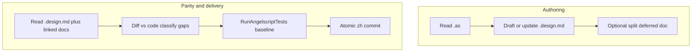

# 代码等效设计文档工作流（索引）

本页是**可搜索的入口**；**可执行步骤与模板**以 Kit 技能 **design-doc-code-parity**（`.cursor/skills/design-doc-code-parity/SKILL.md`）为唯一权威。

## 双路径总览

- **Authoring**：从实现反写「可据此改代码」的规格；大文档按数据链拆分，主文档写清范围与链接。
- **Parity**：规格与实现逐项对照；改行为走 TDD；仅改注释/文档时仍建议跑 AS 测试作回归门禁。
- **末尾「计划」小节**：先合并阅读主文档 + 拆分文档 + `plan-*.md`；删符号前做引用门禁；**全部落地后从 `.design.md` 删除该计划小节**，把结果合并进前面各节正文；审计靠 Git，避免规格与旧任务列表双轨。

## 与 Rule / Skill 的对应

| 触发 | Rule | Skill |
|------|------|--------|
| 编辑 `*.design.md`、等效对齐、末尾计划 | `design-doc-equivalent` | `design-doc-code-parity` |

## 相关文档

- Git 原子提交与 TDD：[14-git-atomic-commits-tdd.md](14-git-atomic-commits-tdd.md)
- 复盘自动化闭环：[15-retro-automation-workflow.md](15-retro-automation-workflow.md)
- 蓝图离线索引与在线读图分工：[07-blueprint-query-workflow.md](07-blueprint-query-workflow.md)
